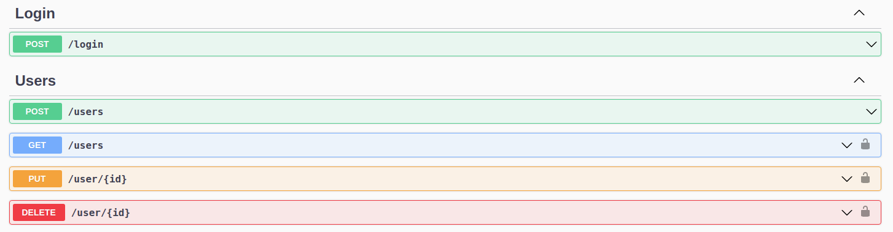

# my-nodejs-api

A Nodejs API.

## Requirements

| Name | Version |
|------|---------|
| [Nodejs](https://nodejs.org/en/) | >= v12.20.1 |
| [Yarn](https://classic.yarnpkg.com/en/) | 1.22.10 |

###### What can I do?

This API example provides a complete CRUD for a User. Here are a few examples to get you started:

- Login a User
- List all Users.
- Create a User.
- Update a User.
- Delete a User.


## Getting Started

### Installation

To use this API on your machine, first clone the project:

```bash
➜ git clone git@github.com:marcelomansur/my-simple-nodejs-api.git
```

Then install all dependencies using Yarn:

```bash
➜ yarn install
```

### Usage

To start using this API, run:

```bash
➜ yarn dev
```

The API will be exposed at localhost on port 3000:

```
➜ curl http://localhost:3000
Hello API
```

### Routes

The API routes are avaiable on a Swagger UI at:

```url
http://localhost:3000/api-docs/
``` 




### Features

- RESTful API
- [Express](https://expressjs.com/) - Web framework
- [Cors](https://www.npmjs.com/package/cors) - CORS middleware
- [Helmet](https://www.npmjs.com/package/helmet) - HTTP security middleware
- [Morgan](https://www.npmjs.com/package/morgan) - Logger middleware
- [Swagger](https://www.npmjs.com/package/swagger-ui-express) - UI for api-docs
- [JWT](https://www.npmjs.com/package/jsonwebtoken) - Implementation of JWT
- [TypeORM](https://www.npmjs.com/package/typeorm) - ORM for typescript
- [Sqlite3](https://www.npmjs.com/package/sqlite3) - Database used in this example